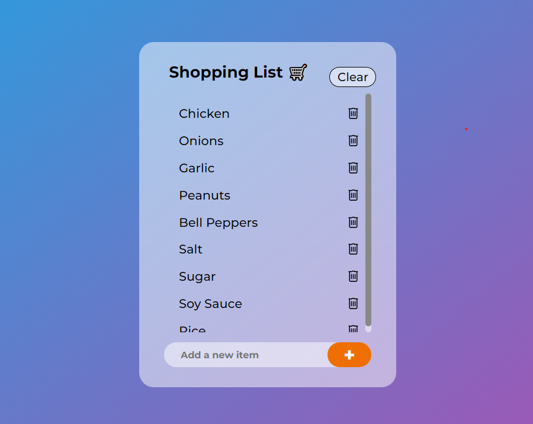

# Shopping List Web App 🛒

This is a simple and user-friendly shopping list application built using HTML, CSS, JavaScript, and jQuery.

## Features

- Add new items to your shopping list.
- Check off items as you shop.
- Remove items from your list.
- Clear your entire shopping list with one click.

## Getting Started

To use the Shopping List Web App, simply open the `index.html` file in your web browser and start managing your shopping list.

## Technologies Used

- HTML
- CSS
- JavaScript
- jQuery

Happy shopping! 🛒
